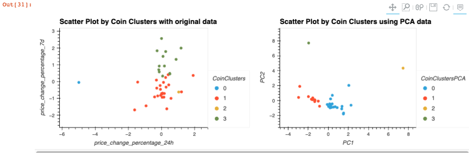

# CryptoClustering
## Overview
- The code in this repository performs a K Means cluster analysis of the price changes in cryptocurrencies. 

- The number of clusters has been determined using the 'elbow method.'

- The Cluster analysis has been optimised using Principal Component Analysis.

- The PCA cluster is then compared to the original cluster to determine which is the more accurate cluster model.

- The cluster that uses the PCA data is more defined than when we use the initial data, suggesting that the PCA model has less noise and more separability than the original model.

## Access and Usage
- To clone this repository enter the following command ``git clone https://github.com/GPN87/CryptoClustering.git``